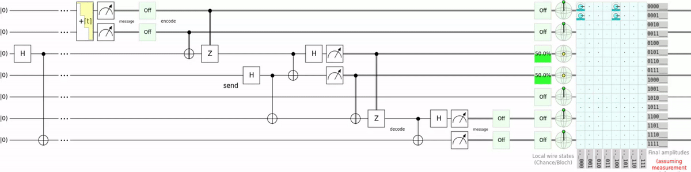
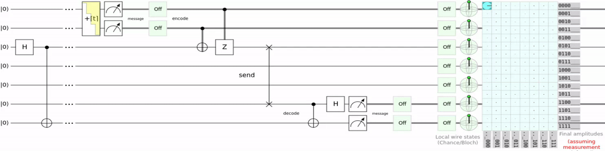
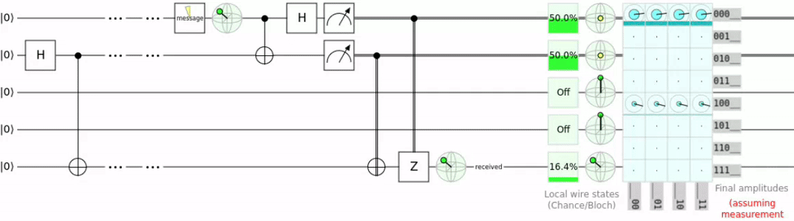

# Superdense Coding With Teleportation
This Q# script encodes text into qubits, teleports them, and decodes the message. Saying it like this makes this project look way too good. 
This project exists only for me to be able to say that i teleported ":3".

To quickly show what the script does, let's look at a circuit representation.



If you know a bit about quantum mechanics, this probably looks familiar.
Because this is superdense coding with teleportation instead of a switch gate.

For reference here is superdense coding:



and here is teleportation:



## But what do i mean by teleported ":3"
So in essence what i am doning is superdense coding with extra steps. Superdense coding is transporting 2 regular bits with 1 qubit. 

At the entry point we have the following lines. 
```qsharp
// 0011 1010 0011 0011 is binary ASCII for :3
let messages = [(false, false), (true, true), (true, false), (true, false),  // :
                (false, false), (true, true), (false, false), (true, true)]; // 3
```
Here i create an array of tupels, each containing 2 booleans. This represents the bits to be teleported. Then the "Superdense Coding with Teleportation" operation is performed on each tuple in the array. The result is then aggregated and returned as integers. (because it looks nicer as an output)

## Results of a real run
I ran this script on Quantinnum's [H1 quantum computer](https://www.quantinuum.com/hardware/h1) via Azure Quantum for 10 shots. This consumed 7.11 Azure Quantum credits which would be 89$.

Here is the histogram output.
```json
{
    "Histogram":
    [
        "[0, 0, 1, 1, 1, 0, 1, 0, 0, 0, 1, 1, 0, 0, 1, 1]",0.8,
        "[0, 0, 1, 1, 1, 0, 1, 0, 0, 0, 0, 1, 0, 0, 1, 1]",0.1,
        "[0, 0, 1, 1, 1, 0, 1, 0, 0, 0, 1, 1, 0, 0, 0, 1]",0.1
    ]
}
```
We can see that out of 10 shots 8 where without error. So i teleported ":3" 8 times tehe >:3. 